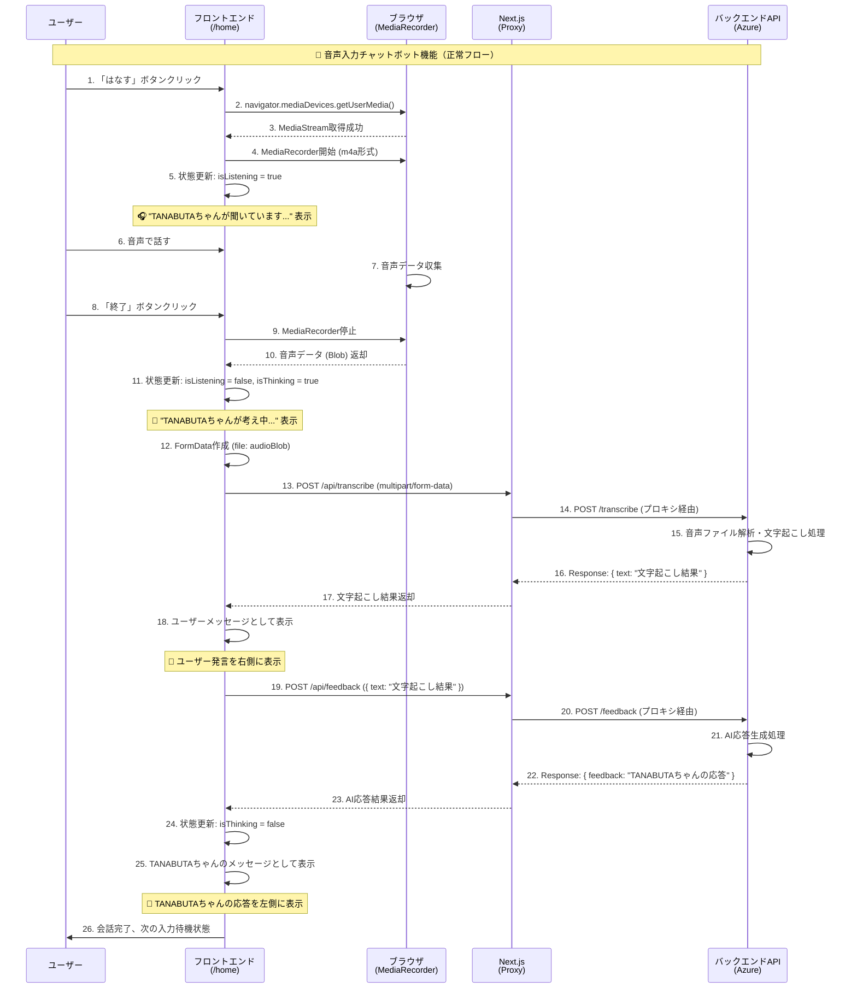
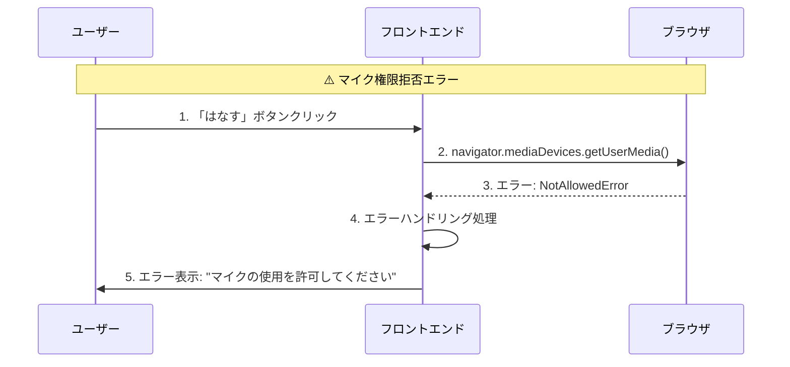
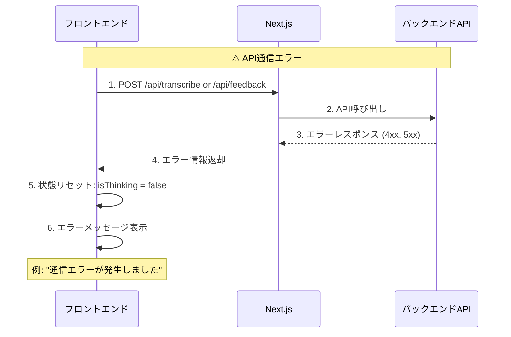
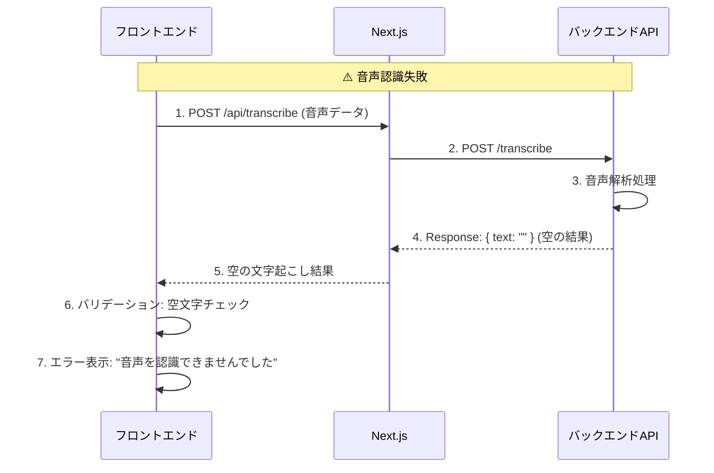

# チャットbot機能 実装要件定義書

## 1. プロジェクト概要

### 1.1 目的
ホームページ（`/home`）に実装されているダミーのチャットbot機能を、実際のAPIエンドポイント（`/feedback`、`/transcribe`）と連携して動作するよう改修する。

### 1.2 現状分析

#### 現在のダミー実装 (`src/app/home/page.tsx`)
- **静的な会話**: ハードコードされたユーザーメッセージとbot応答
- **タイマーベース**: 5秒の固定待機時間でダミー応答を表示
- **音声機能なし**: マイクボタンはUIの状態変更のみ
- **実API連携なし**: バックエンドとの通信は行われていない

#### 削除対象のダミーコード
```typescript
// 以下の部分はダミー実装のため削除
- 静的なユーザーメッセージ（line 88-89）
- 固定のbot応答（line 142-143）  
- useEffect内のタイマー処理（line 26-29）
- ハードコードされた会話フロー
```

## 2. 利用するAPI仕様

### 2.1 `/transcribe` エンドポイント
```
POST /transcribe
- 機能: 音声ファイルから文字起こしを実行
- Content-Type: multipart/form-data
- Request Body: { file: binary }
- Response: { 文字起こし結果 }
- 用途: 音声入力をテキストに変換
```

### 2.2 `/feedback` エンドポイント  
```
POST /feedback
- 機能: たなブタちゃんから可愛いフィードバックを取得
- Content-Type: application/json
- Request Body: { text: string }
- Response: { feedback: string }
- 用途: ユーザーの質問や発言に対するbot応答生成
```

## 3. 実装要件

### 3.1 機能要件

#### 3.1.1 音声入力機能
- **音声録音**: Web Audio APIを使用してブラウザ上で音声録音
- **録音開始**: "はなす"ボタンクリックで録音開始、UIを"聞いています"状態に変更
- **録音停止**: "終了"ボタンクリックで録音停止
- **音声送信**: 録音したオーディオファイルを`/transcribe`エンドポイントに送信
- **文字起こし表示**: API応答をユーザーメッセージとしてチャットUIに表示

#### 3.1.2 テキストチャット機能  
- **文字起こし結果処理**: `/transcribe`から取得したテキストを自動でフィードバックAPIに送信
- **Bot応答取得**: ユーザーのテキストを`/feedback`エンドポイントに送信
- **応答表示**: API応答をTANABUTAちゃんの発言として表示
- **エラーハンドリング**: API通信エラー時の適切なエラーメッセージ表示

#### 3.1.3 UI/UX要件
- **既存デザイン維持**: 現在のチャットUIデザインを保持
- **ローディング状態**: API通信中の適切なローディング表示
- **アニメーション**: Framer Motionを使用したスムーズな画面遷移
- **レスポンシブ対応**: モバイルデバイスでの音声録音対応

### 3.2 技術要件

#### 3.2.1 フロントエンド技術
- **音声録音**: `MediaRecorder API`または`navigator.mediaDevices.getUserMedia()`
- **ファイル形式**: m4a、WebM、WAV、MP3など（APIサーバーが対応する形式、推奨：m4a）
- **HTTP通信**: Axios（既存のライブラリを使用）
- **状態管理**: React useState（既存パターンを継続）

#### 3.2.2 API通信
- **Base URL**: `process.env.NEXT_PUBLIC_API_BASE_URL`
- **認証**: Cookie ベースセッション（withCredentials: true）
- **エラーハンドリング**: try-catch文による例外処理
- **タイムアウト**: 適切なタイムアウト設定

### 3.3 非機能要件

#### 3.3.1 パフォーマンス
- **音声ファイルサイズ**: 録音時間制限（例：30秒以内）
- **API応答時間**: ローディング表示で長時間待機への対応
- **メモリ使用量**: 音声データの適切な解放

#### 3.3.2 ユーザビリティ
- **マイク権限**: ブラウザマイク権限の適切な要求と処理
- **フィードバック**: 録音状態の明確な視覚的表示
- **エラーメッセージ**: ユーザーフレンドリーなエラー表示

## 4. 実装フロー

### 4.1 音声入力フロー
```
1. ユーザーが"はなす"ボタンをクリック
2. マイク権限を要求
3. 音声録音開始、UI状態を"聞いています"に変更
4. ユーザーが"終了"ボタンをクリック  
5. 録音停止、音声データを取得
6. 音声データを/transcribeエンドポイントに送信
7. 文字起こし結果をユーザーメッセージとして表示
8. 自動的に/feedbackエンドポイントに文字起こし結果を送信
9. Bot応答を取得してTANABUTAちゃんの発言として表示
```

### 4.2 正常フロー シーケンス図



### 4.3 エラーケース シーケンス図

#### 4.3.1 マイク権限エラー


#### 4.3.2 API通信エラー


#### 4.3.3 音声認識エラー


### 4.4 エラーハンドリングフロー
```
- マイク権限拒否: "マイクの使用を許可してください"メッセージ
- 録音失敗: "音声の録音に失敗しました"メッセージ  
- API通信エラー: "通信エラーが発生しました。しばらくしてから再度お試しください"
- タイムアウト: "応答に時間がかかっています。もう一度お試しください"
```

## 5. 実装ステップ

### 5.1 Phase 1: ダミーコード削除
- [ ] 静的なユーザーメッセージを削除
- [ ] 固定のbot応答を削除
- [ ] タイマーベースの処理を削除
- [ ] 不要な状態変数を整理

### 5.2 Phase 2: 音声録音機能実装
- [ ] MediaRecorder APIの実装
- [ ] マイク権限の要求処理
- [ ] 音声データの取得とFormData作成
- [ ] `/transcribe`エンドポイントとの通信実装

### 5.3 Phase 3: チャット機能実装  
- [ ] `/feedback`エンドポイントとの通信実装
- [ ] ユーザーメッセージとBot応答の動的表示
- [ ] チャット履歴の管理（必要に応じて）

### 5.4 Phase 4: エラーハンドリングとUX改善
- [ ] 各種エラーケースの処理実装
- [ ] ローディング状態の改善
- [ ] UI/UXの最終調整

## 6. 技術課題と対策

### 6.1 ブラウザ互換性
- **課題**: ブラウザによる音声API対応状況の違い
- **対策**: 主要ブラウザでの動作確認、フォールバック処理の実装

### 6.2 音声品質
- **課題**: 録音音質がAPIの文字起こし精度に影響
- **対策**: 適切なサンプリングレート設定、ノイズ対策

### 6.3 ファイルサイズ制限
- **課題**: 大きな音声ファイルの送信
- **対策**: 録音時間制限、音声圧縮の検討

## 7. テスト要件

### 7.1 機能テスト
- [ ] 音声録音の開始・停止
- [ ] 文字起こしAPIの通信
- [ ] フィードバックAPIの通信  
- [ ] エラーケースの動作確認

### 7.2 ブラウザテスト
- [ ] Chrome（デスクトップ・モバイル）
- [ ] Safari（デスクトップ・モバイル）
- [ ] Firefox（デスクトップ）
- [ ] Edge（デスクトップ）

### 7.3 デバイステスト
- [ ] デスクトップPC（内蔵マイク）
- [ ] スマートフォン（内蔵マイク）
- [ ] 外部マイクデバイス

## 8. セキュリティ考慮事項

### 8.1 音声データの取り扱い
- 音声データは一時的な処理のみ、長期保存しない
- HTTPS通信による暗号化
- 適切な権限管理

### 8.2 API通信
- セッションベース認証の適切な処理
- CORS設定の確認
- 入力値検証の実装

---

**作成日**: 2025年8月12日  
**更新日**: 2025年8月12日  
**バージョン**: 1.0.0  
**作成者**: Claude Code Assistant