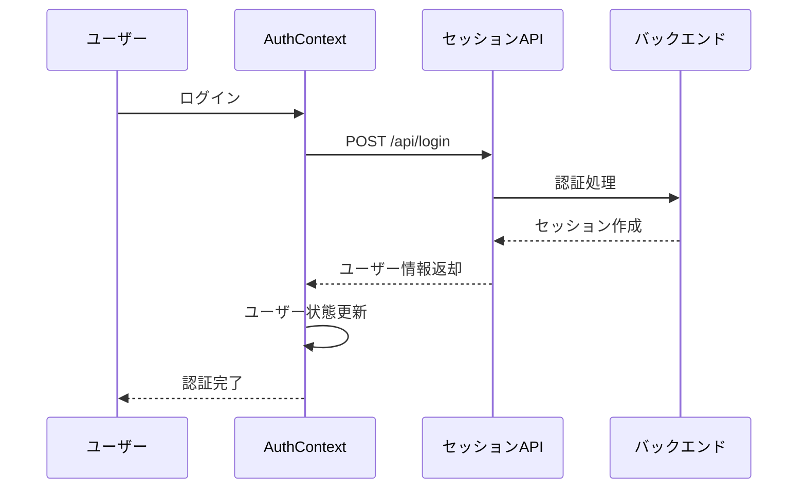
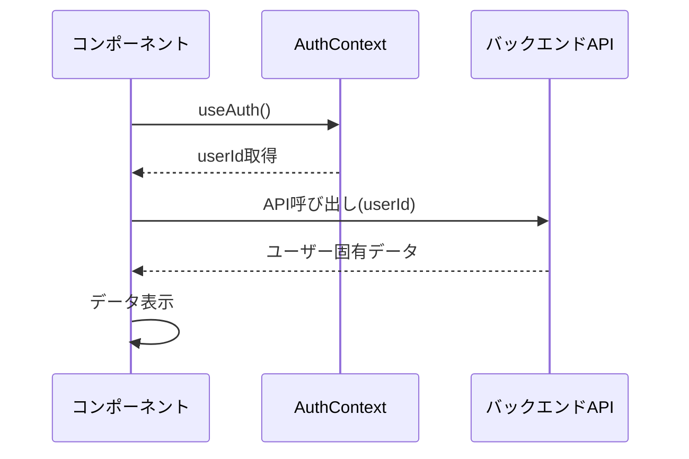

# ユーザー認証連携実装仕様書
# ダミーユーザーID（1）から実際の認証ユーザーIDへの移行

## 1. 現状分析

### 1.1 現在のダミーユーザーID使用箇所

#### 1.1.1 チャットボット機能（`/src/app/home/page.tsx`）
```typescript
// Line 230: ダミーユーザーID使用
const feedbackRequestBody: any = {
  text: transcribedText,
  user_id: 1 // ← ダミーユーザーID
}
```

#### 1.1.2 レシピ機能（推定）
- `/onboarding/recipes` API呼び出し時
- `user_id=1` パラメータでのレシピ取得

#### 1.1.3 アセット機能（推定）
- ユーザー固有のアセットデータ取得
- ダミーユーザーIDによる固定データ表示

## 2. 技術要件

### 2.1 認証コンテキストの実装

#### 2.1.1 AuthContext作成
```typescript
// src/context/AuthContext.tsx
interface AuthContextType {
  user: User | null;
  userId: number | null;
  isAuthenticated: boolean;
  isLoading: boolean;
  login: (credentials: LoginCredentials) => Promise<void>;
  logout: () => Promise<void>;
  refreshUser: () => Promise<void>;
}

interface User {
  id: number;
  email: string;
  nickname?: string;
  onboardingCompleted: boolean;
}
```

#### 2.1.2 useAuth カスタムフック
```typescript
// src/hooks/useAuth.ts
export const useAuth = () => {
  const context = useContext(AuthContext);
  if (!context) {
    throw new Error('useAuth must be used within AuthProvider');
  }
  return context;
};
```

### 2.2 ユーザー情報取得API

#### 2.2.1 新規APIエンドポイント
```typescript
// GET /api/user/session
interface UserSessionResponse {
  success: boolean;
  user: {
    id: number;
    email: string;
    nickname?: string;
    onboardingCompleted: boolean;
  } | null;
}
```

#### 2.2.2 API実装
```typescript
// src/app/api/user/session/route.ts
export async function GET(request: Request) {
  try {
    // Cookie から認証情報を取得
    const userSession = await getCurrentUserSession(request);
    
    if (!userSession) {
      return NextResponse.json({ success: false, user: null });
    }
    
    return NextResponse.json({
      success: true,
      user: {
        id: userSession.id,
        email: userSession.email,
        nickname: userSession.nickname,
        onboardingCompleted: userSession.onboardingCompleted
      }
    });
  } catch (error) {
    return NextResponse.json(
      { success: false, error: 'Session fetch failed' },
      { status: 500 }
    );
  }
}
```

## 3. 実装手順

### 3.1 Phase 1: 認証基盤実装

#### Step 1-1: AuthContextの作成
```bash
# ファイル作成
touch src/context/AuthContext.tsx
touch src/hooks/useAuth.ts
touch src/hooks/useUser.ts
```

#### Step 1-2: ユーザーセッションAPI実装
```bash
# APIルート作成
mkdir -p src/app/api/user
touch src/app/api/user/session/route.ts
```

#### Step 1-3: 型定義追加
```typescript
// src/types/auth.ts
export interface User {
  id: number;
  email: string;
  nickname?: string;
  onboardingCompleted: boolean;
  createdAt: string;
  updatedAt: string;
}

export interface AuthState {
  user: User | null;
  isAuthenticated: boolean;
  isLoading: boolean;
}
```

### 3.2 Phase 2: 既存機能の修正

#### Step 2-1: チャットボット機能修正
```typescript
// src/app/home/page.tsx - 修正前
const feedbackRequestBody: any = {
  text: transcribedText,
  user_id: 1 // ダミーユーザーID
}

// 修正後
const { userId } = useAuth();
const feedbackRequestBody: any = {
  text: transcribedText,
  user_id: userId || 1 // fallback for safety
}
```

#### Step 2-2: レシピ機能修正
```typescript
// src/hooks/useRecipes.ts - 新規作成
export const useRecipes = () => {
  const { userId } = useAuth();
  
  const fetchRecipes = useCallback(async () => {
    if (!userId) return;
    
    const response = await axios.get('/api/onboarding/recipes', {
      params: { user_id: userId }, // 実際のユーザーID使用
      withCredentials: true
    });
    
    return response.data;
  }, [userId]);
  
  // ... rest of implementation
};
```

#### Step 2-3: アセット機能実装
```typescript
// src/app/assets/page.tsx - 新規作成
export default function AssetsPage() {
  const { userId, isAuthenticated } = useAuth();
  
  // 認証チェック
  if (!isAuthenticated || !userId) {
    redirect('/auth/login');
  }
  
  // ユーザー固有のアセットデータ取得
  // ...
}
```

### 3.3 Phase 3: AuthProvider統合

#### Step 3-1: レイアウトでのProvider設定
```typescript
// src/app/layout.tsx
import { AuthProvider } from '@/context/AuthContext';

export default function RootLayout({ children }: { children: React.ReactNode }) {
  return (
    <html lang="ja">
      <body className={inter.className}>
        <AuthProvider>
          <div className="fixed inset-0 -z-50 bg-gradient-to-br from-purple-50 via-pink-50 to-blue-50" />
          <AppShell>{children}</AppShell>
        </AuthProvider>
      </body>
    </html>
  );
}
```

#### Step 3-2: 認証状態に応じたルーティング
```typescript
// src/components/AuthGuard.tsx
export const AuthGuard = ({ children }: { children: React.ReactNode }) => {
  const { isAuthenticated, isLoading } = useAuth();
  
  if (isLoading) {
    return <LoadingSpinner />;
  }
  
  if (!isAuthenticated) {
    redirect('/auth/login');
  }
  
  return <>{children}</>;
};
```

## 4. データフロー設計

### 4.1 認証フロー


### 4.2 ユーザーID連携フロー


## 5. エラーハンドリング

### 5.1 認証エラー対応
```typescript
// AuthContext内でのエラーハンドリング
const handleAuthError = (error: any) => {
  if (error.response?.status === 401) {
    // セッション期限切れ
    logout();
    redirect('/auth/login');
  } else if (error.response?.status === 403) {
    // 権限エラー
    setError('アクセス権限がありません');
  } else {
    // その他のエラー
    setError('認証エラーが発生しました');
  }
};
```

### 5.2 API呼び出し時のfallback
```typescript
// ユーザーIDが取得できない場合のfallback
const safeUserId = userId || 1; // 緊急時のfallback

// ただし、warnings出力
if (!userId) {
  console.warn('User ID not available, using fallback');
}
```

## 6. セキュリティ考慮事項

### 6.1 セッション管理
- **Secure Cookie**: HTTPS環境でのSecureフラグ
- **HttpOnly**: XSS攻撃防止
- **SameSite**: CSRF攻撃防止

### 6.2 認証状態検証
```typescript
// 定期的なセッション検証
useEffect(() => {
  const interval = setInterval(async () => {
    try {
      await refreshUser();
    } catch (error) {
      // セッション期限切れの場合はログアウト
      logout();
    }
  }, 5 * 60 * 1000); // 5分ごと

  return () => clearInterval(interval);
}, []);
```

## 7. パフォーマンス最適化

### 7.1 ユーザー情報キャッシュ
```typescript
// React Query / SWR を活用したキャッシュ戦略
const useUserSession = () => {
  return useSWR('/api/user/session', fetcher, {
    revalidateOnFocus: false,
    revalidateOnReconnect: true,
    dedupingInterval: 30000, // 30秒間は重複リクエスト防止
  });
};
```

### 7.2 条件付きレンダリング
```typescript
// ユーザー情報が必要な場合のみ取得
const ConditionalUserData = () => {
  const { isAuthenticated } = useAuth();
  
  if (!isAuthenticated) {
    return <LoginPrompt />;
  }
  
  return <UserSpecificContent />;
};
```

## 8. テスト戦略

### 8.1 単体テスト
```typescript
// AuthContext のテスト
describe('AuthContext', () => {
  test('should provide user information when authenticated', () => {
    // テスト実装
  });
  
  test('should handle logout correctly', () => {
    // テスト実装
  });
});
```

### 8.2 統合テスト
```typescript
// E2Eテストでの認証フロー確認
test('user can login and access protected features', async ({ page }) => {
  await page.goto('/auth/login');
  await page.fill('input[type="email"]', 'test@example.com');
  await page.fill('input[type="password"]', 'password');
  await page.click('button[type="submit"]');
  
  // ホーム画面遷移確認
  await expect(page).toHaveURL('/home');
  
  // ユーザー固有データ表示確認
  await expect(page.locator('[data-testid="user-content"]')).toBeVisible();
});
```

## 9. 移行チェックリスト

### 9.1 実装チェック
- [ ] AuthContext実装完了
- [ ] useAuth フック実装完了
- [ ] ユーザーセッションAPI実装完了
- [ ] チャットボット機能修正完了
- [ ] レシピ機能修正完了
- [ ] アセット機能実装完了

### 9.2 品質チェック
- [ ] TypeScriptエラー0件
- [ ] 全機能でダミーユーザーID削除確認
- [ ] 認証状態管理正常動作確認
- [ ] エラーハンドリング適切実装確認

### 9.3 セキュリティチェック
- [ ] セッション管理安全性確認
- [ ] 認証状態検証実装確認
- [ ] 権限チェック実装確認
- [ ] XSS/CSRF対策実装確認

---

**作成日**: 2025-08-17  
**最終更新**: 2025-08-17  
**バージョン**: 1.0.0  
**作成者**: Claude Code Assistant